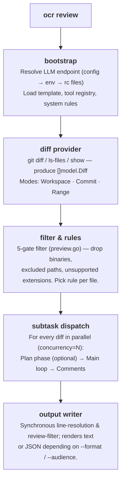
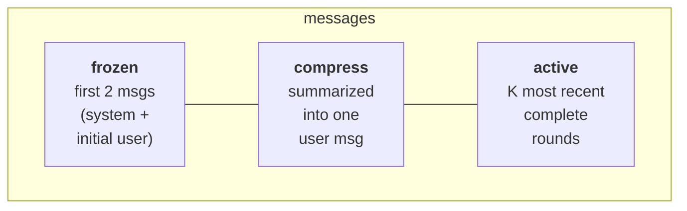

Подробное описание внутренней работы `ocr review`: от нажатия Enter до
появления JSON в терминале. Материал поможет понять устройство OCR,
диагностировать его поведение, подбирать флаги запуска и разбираться в
реализации проекта.

## Высокоуровневый конвейер



Оркестрация реализована в пакете
[`internal/agent/`](https://github.com/alibaba/open-code-review/blob/main/internal/agent/).
В него входят четыре файла:

- `agent.go` — основной цикл и диспетчеризация;
- `compression.go` — сжатие памяти;
- `preview.go` — фильтр файлов;
- `util.go` — вспомогательные функции.

Основные точки входа:

- `Agent.Run` — начало конвейера;
- `Agent.dispatchSubtasks` — распределение задач по отдельным файлам.

## Провайдер diff

В `internal/diff/git.go` определена структура `Provider`, приватное поле `mode`
которой (тип `Mode`, перечисление на основе `int`) выбирает один из трёх
режимов, соответствующих флагам CLI:

| Режим | Условие | Результат |
|---|---|---|
| `Workspace` | без флагов | индексированные, неиндексированные и неотслеживаемые изменения |
| `Commit` | `--commit <sha>` / `-c <sha>` | изменения, внесённые `<sha>` (через `git show <sha>`, что эквивалентно diff `<sha>^..<sha>`) |
| `Range` | `--from <a> --to <b>` | `merge-base(a, b)..b` |

Каждый diff содержит старый и новый пути, старые и новые фрагменты, количество
добавлений и удалений, признак бинарного файла и сведения о переименовании.
Значение `DiffContextLines` зафиксировано на **3** — это же значение Git
использует по умолчанию.

Неотслеживаемые файлы читаются с диска и считаются целиком добавленными, чтобы
их можно было проверить до коммита.

## Пятиступенчатый фильтр файлов

После загрузки diff каждый файл проходит через функцию
[`whyExcluded`](https://github.com/alibaba/open-code-review/blob/main/internal/agent/preview.go).
Она возвращает одно из следующих значений:

```
binary          — файл является бинарным
user_exclude    — совпадение с шаблоном из списка `exclude`
unsupported_ext — расширение отсутствует в supported_file_types.json
default_path    — совпадение со встроенным шаблоном исключения тестовых файлов
```

Если файл не исключён, функция возвращает пустое значение.

`deleted` **не** возвращается функцией `whyExcluded`: оно вычисляется позже в
`Preview()`, когда diff оставленного файла сообщает `IsDeleted`.

Проверки выполняются в таком порядке:

1. `binary` — бинарные файлы отбрасываются первыми.
2. `user_exclude` — значение `exclude` вашего проекта всегда имеет приоритет.
3. `user_include` — если у фильтра есть шаблоны включения **и** файл совпадает
   с одним из них, он сразу сохраняется (возвращается пустое значение), минуя
   расположенные ниже проверки `unsupported_ext` и `default_path`.
4. `unsupported_ext` фильтрует по списку допустимых расширений.
5. `default_path` — последняя проверка: она сопоставляет встроенные шаблоны
   исключения **тестовых файлов** (`**/*_test.go`,
   `**/*.test.{js,jsx,ts,tsx}`, `**/__tests__/**`, `**/*_test.py`,
   `**/*_spec.rb`, `**/*.test.ets`, …). Каждый шаблон начинается с `**/`.

Отсев нерелевантных каталогов (`vendor/`, `node_modules/`, `target/` и т. д.)
происходит раньше, на уровне провайдера diff. Список
`providerDirIgnoreDirs` в `internal/diff/git.go` определяет такие каталоги, а
функция `filterDiffs` удаляет их diff до фильтрации отдельных файлов.

Чтобы увидеть полный результат фильтрации, не потратив ни одного токена,
запустите `ocr review --preview`. Полный алгоритм описан в разделе
[Правила ревью](../review-rules/#how-files-are-filtered).

## Подзадача для файла: планирование и основной цикл

Для каждого файла, прошедшего фильтрацию, OCR запускает субагента. Каждый
субагент выполняется в отдельной горутине, число которых ограничено
`--concurrency` (по умолчанию **8**), и имеет собственный буфер сообщений LLM.

Подзадача включает до **двух этапов**:

### Этап 1 — Планирование (необязательно)

```go
threshold := template.PlanModeLineThreshold     // 50
changeLines := d.Insertions + d.Deletions
if changeLines < threshold { skip plan }
```

Для небольших diff планирование увеличивает задержку, но не приносит пользы,
поэтому оно незаметно пропускается и сразу запускается основной цикл. Для
более крупных diff OCR выполняет **один** вызов LLM с `PLAN_TASK`: поле `Tools`
не передаётся, поэтому во время планирования модель не может вызывать
инструменты. Доступное только для чтения подмножество инструментов
(`code_search`, `file_read_diff`, `file_find` — три инструмента, у которых в
`tools.json` флаг `plan_task` имеет значение `true`) встраивается как обычный
текст через плейсхолдер `{{plan_tools}}` (формируется функцией
`formatToolDefs`), чтобы модель знала, что будет доступно позднее. Модель
возвращает контрольный список, который становится значением
`{{plan_guidance}}` в основном промпте.

### Этап 2 — Основной цикл

Основной цикл формирует промпт `MAIN_TASK` и ведёт с моделью диалог с
использованием инструментов. Полный набор добавляет к инструментам этапа
планирования **`task_done`**, **`code_comment`** и **`file_read`**. Полный
перечень приведён в разделе [Инструменты](../tools/).

```
loop up to MAX_TOOL_REQUEST_TIMES (default 30):
    response = llm.complete(messages, tools)
    if response.toolCalls is empty:
        nudge model with "You did not successfully call any tools.
                          Please try again or use task_done if finished."
        continue
    for each call: execute → collect result
    if any call was task_done: break
    addNextMessage(...)              # may trigger compression
```

У цикла есть пять условий завершения:

1. Был вызван `task_done`.
2. Исчерпано число `MAX_TOOL_REQUEST_TIMES`.
3. В трёх последовательных раундах не получено допустимых результатов
   инструментов (`maxConsecutiveEmptyRounds = 3`).
4. Контекст отменён.
5. `addNextMessage` вернул `false`: сжатие не смогло вернуть буфер сообщений
   ниже порога предупреждения.

Во всех случаях собранные вызовы `code_comment` становятся комментариями
ревью.

## Сжатие памяти

Длительный цикл использования инструментов со временем переполняет контекстное
окно. OCR управляет этим с помощью стратегии **разделения на три зоны**,
которая срабатывает при достижении бюджета токенов, заданного в
`MAX_TOKENS = 58888`:

| Порог | Константа | Действие |
|---|---|---|
| 60 % от MAX_TOKENS | `tokenSoftThreshold` | Запускает **асинхронное** фоновое сжатие; текущий цикл продолжает выполняться. |
| 80 % от MAX_TOKENS | `tokenWarningThreshold` | Выполняет сжатие **синхронно** перед отправкой следующего запроса. |

### Три зоны



«Раунд» — это одно сообщение ассистента и следующие за ним сообщения с
результатами инструментов. `partitionMessages` обходит раунды с конца,
сохраняя столько, сколько помещается в
`(0.80 × MAX_TOKENS) - reservedTokens`. Всё более старое содержимое образует
**зону сжатия**.

Зона сжатия преобразуется в XML и передаётся модели с промптом
`MEMORY_COMPRESSION_TASK`; возвращённая сводка добавляется к исходному
сообщению пользователя внутри тегов `<previous_review_summary>`.

После сжатия: `messages = frozen[2] + compressed_user_msg + active`.

```go
// compression.go
func (a *Agent) runCompression(ctx context.Context, msgs []llm.Message, filePath string) ([]llm.Message, error) {
    part := partitionMessages(msgs, a.args.Template.MaxTokens, 0)
    contextXML := buildMessageXML(msgs[part.frozenEnd:part.compressEnd])
    // … call MEMORY_COMPRESSION_TASK …
    rebuilt[1] = llm.NewTextMessage(role, currentText+
        "\n\n<previous_review_summary>\n"+rawSummary+"\n</previous_review_summary>")
    for i := part.compressEnd; i < len(msgs); i++ {
        rebuilt = append(rebuilt, msgs[i])
    }
    return rebuilt, nil
}
```

### Асинхронное и синхронное сжатие

При асинхронном варианте основной цикл продолжает выполнять вызовы
инструментов, пока сжатие идёт в фоне. Во время следующей проверки числа
токенов готовая сводка подставляется функцией `tryApplyPendingCompression`.
Если до завершения асинхронной задачи доля токенов пересекает порог
предупреждения, цикл приостанавливается и запускает `runCompression`
синхронно, гарантируя, что следующий запрос поместится в контекст.

## Конвейер обработки комментариев

Каждый вызов инструмента `code_comment` создаёт один или несколько черновых
комментариев. Они проходят через **CommentWorkerPool** (пул горутин
фиксированного размера), чтобы основной цикл использования инструментов не
блокировался на постобработке:

1. **Определение строк** (в обработчике) — `existing_code` сопоставляется с
   diff при помощи алгоритма скользящего окна для вычисления точных
   `start_line` / `end_line`. Если сопоставление не удаётся, оба значения
   становятся равны `0`. Диапазон строк `0` служит неявным признаком
   «непривязанного» комментария, который пользователь должен найти вручную
   (отдельный флаг не сохраняется; последующие потребители проверяют
   `start_line == 0`).
2. **Задача повторного позиционирования** *(необязательный резервный вариант)*
   — если определить строки в нетривиальном diff не удалось, OCR запускает
   промпт `RE_LOCATION_TASK`, прося модель заново привязать фрагмент. Это
   полезно для перефразированных строк `existing_code`.
3. **Фильтр ревью** — после завершения основного цикла (и опустошения пула
   обработчиков) вызов LLM `REVIEW_FILTER_TASK` проверяет собранные комментарии
   по diff и удаляет доказуемо неверные. Ошибки на этом этапе записываются в
   журнал и игнорируются.
4. **Повторное определение строк** — после возврата из `Agent.Run` команда
   верхнего уровня повторно запускает `diff.ResolveLineNumbers` для полного
   набора комментариев (см. `cmd/opencodereview/review_cmd.go`), чтобы
   обработать комментарии, в которых `existing_code` охватывает несколько
   файлов или был изменён на этапе повторного позиционирования.
5. **Формирование вывода** — в текст или JSON в зависимости от `--format`.

## Ограничители бюджета токенов

Ещё до вызова LLM OCR выполняет проверку с немедленным завершением:

```go
tokenLimit := MaxTokens * 4 / 5     // 80 %
if countMessagesTokens(messages) > tokenLimit {
    record warning "token_threshold_exceeded"
    return nil      // skip this file
}
```

Она отсекает огромные diff (автоматически созданные lock-файлы, рефакторинги
с тысячами затронутых строк) до того, как они потребуют запрос. Пропущенный
файл отмечается как некритическое предупреждение в stdout и добавляется в
массив JSON `warnings`.

Вторая проверка выполняется в `filterLargeDiffs`: если один diff превышает
80 % от `MAX_TOKENS`, он отбрасывается ещё до запуска диспетчера отдельных
файлов.

## Шаблон и плейсхолдеры

В `internal/config/template/task_template.json` находятся **пять промптов**:

| Ключ | Назначение |
|---|---|
| `PLAN_TASK` | Этап планирования — создаёт контрольный список. |
| `MAIN_TASK` | Основной цикл ревью — выполняет вызовы `code_comment`. |
| `MEMORY_COMPRESSION_TASK` | Создаёт сводку зоны сжатия. |
| `REVIEW_FILTER_TASK` | Этап после основного цикла, удаляющий доказуемо неверные комментарии. |
| `RE_LOCATION_TASK` | Повторно привязывает комментарий, для которого не удалось сопоставить `existing_code`. |

Каждый промпт — это список ссылок `{role, prompt_file}` на файлы `.md` в
каталоге шаблонов (например,
`{"role": "system", "prompt_file": "main_task_system.md"}`). При загрузке
`resolveConversation` читает эти файлы в сообщения `{role, content}` в памяти,
после чего плейсхолдеры шаблона подставляются отдельно для каждого файла:

| Плейсхолдер | Значение |
|---|---|
| `{{system_rule}}` | Текст правила, выбранного из четырёхуровневой цепочки. |
| `{{change_files}}` | Состояние и путь каждого другого изменённого файла в PR. |
| `{{diff}}` | Diff этого файла (необработанный вывод `git diff`). |
| `{{current_file_path}}` | Новый путь этого файла. |
| `{{plan_guidance}}` | Результат этапа планирования; удаляется, если планирование пропущено. |
| `{{plan_tools}}` | Определения инструментов этапа планирования как обычный текст (формируются функцией `formatToolDefs`), используются в системном промпте `PLAN_TASK`. |
| `{{requirement_background}}` | Содержимое флага `--background`. |
| `{{current_system_date_time}}` | Локальная метка времени запуска в формате `YYYY-MM-DD HH:MM` (без секунд и часового пояса). |
| `{{context}}` | Только при сжатии: сообщения, преобразованные в XML для создания сводки. |
| `{{path}}` | Путь файла, используемый в `REVIEW_FILTER_TASK`. |
| `{{comments}}` | Накопленные комментарии (JSON), используемые в `REVIEW_FILTER_TASK`. |

Подстановка плейсхолдеров реализована в
[`agent.go`](https://github.com/alibaba/open-code-review/blob/main/internal/agent/agent.go).
Сам шаблон нельзя переопределить через CLI: чтобы изменить промпты,
отредактируйте
[`task_template.json`](https://github.com/alibaba/open-code-review/blob/main/internal/config/template/task_template.json)
и заново соберите проект. Флаг `--tools` переопределяет *реестр инструментов*
(заменяет JSON, используемый `internal/config/toolsconfig`), а не шаблон. См.
раздел [Инструменты](../tools/#customizing-tools).

> **Особенность синтаксиса плейсхолдеров.** Все перечисленные выше плейсхолдеры
> используют двойные фигурные скобки `{{…}}`, **кроме** `RE_LOCATION_TASK`,
> который подставляет значения в одинарные скобки `{diff}`, `{existing_code}`
> и `{suggestion_content}` (см. `internal/diff/relocation.go`).

## Хранение данных

Каждое ревью записывается на диск в формате JSONL:

```
~/.opencodereview/sessions/<encoded-repo-path>/<session-id>.jsonl
```

Путь репозитория **не** кодируется в base64: функция `encodeRepoPath` (в
`internal/session/persist.go`) заменяет `/` и `\` на `-`, а `:` — на `_`,
делая путь безопасным для файловой системы.

Каждая строка — отдельное событие: отправленный промпт, ответ LLM, вызов
инструмента, результат инструмента, созданный комментарий и т. д. Веб-интерфейс
(`ocr viewer`) читает эти файлы напрямую: базы данных нет, только дополняемые
журналы. Описание интерфейса и схемы событий приведено в разделе
[Просмотр сессий](../viewer/).

## Телеметрия

Когда телеметрия включена, агент создаёт три вида span на уровне конвейера:
`review.run` охватывает всю задачу, `diff.parse` — загрузку diff, а для каждого
проверяемого файла создаётся `subtask.execute.<file>`. Кроме того, в каждой
точке принятия решения создаётся кратковременный span `event.<name>`
(`plan.skipped`, `token.threshold.exceeded`, `subtask.error` и т. д.). Обращения
к LLM и вызовы инструментов записываются только как метрики, а не как span.
Содержимое промптов и ответов **никогда** не прикрепляется к телеметрии; флаг
`OCR_CONTENT_LOGGING` подключён, но сейчас не действует. Полная схема приведена
в разделе [Телеметрия](../telemetry/).

## Что *не* автоматизировано

Некоторые решения намеренно оставлены ручными:

- **При обнаружении эндпоинта нет `fallback`.** Если конфигурация,
  переменные окружения и rc-файлы не дают полный набор `(URL, token, model)`,
  OCR завершается с ненулевым кодом, а не пытается угадать значения.
- **Ошибки субагентов изолируются, но повторных попыток нет.** Ошибка по одному
  файлу создаёт предупреждение, а остальные продолжают обрабатываться.
  Повторные попытки должны выполняться во внешнем конвейере CI, а не в агенте.
- **Нет рассуждения между файлами.** Каждый файл проверяется в отдельном
  диалоге с LLM. Вопросы между файлами решаются вызовами инструментов
  `file_read_diff` / `code_search`, а не общим контекстом. Замечания в таких
  *других* файлах также нельзя использовать как цели комментариев: промпт
  `main_task` предписывает модели использовать контекстные инструменты только
  для понимания и игнорировать проблемы, обнаруженные в файлах за пределами
  текущего diff.

Эти решения обеспечивают **детерминированность каждого файла** и делают
расходы предсказуемыми.

## Карта исходного кода

Если хотите изучить реализацию:

| Аспект | Файл |
|---|---|
| Диспетчеризация команд верхнего уровня | `cmd/opencodereview/main.go` |
| Разбор флагов `review` | `cmd/opencodereview/flags.go` |
| Оркестрация агентов и сжатие | `internal/agent/` (agent.go, compression.go, util.go) |
| Фильтр файлов / предварительный просмотр | `internal/agent/preview.go` |
| Загрузка diff (режимы Git) | `internal/diff/git.go` |
| Цепочка разрешения правил | `internal/config/rules/system_rules.go` |
| Реестр и реализации инструментов | `internal/tool/` |
| Средство разрешения эндпоинта LLM | `internal/llm/resolver.go` |
| Средство записи сессий JSONL | `internal/session/persist.go` |
| Веб-просмотрщик | `internal/viewer/server.go` |

Инструкции по сборке и тестированию приведены в разделе
[Участие в разработке](../contributing/).

## См. также

- [Инструменты](../tools/) — шесть инструментов, вызываемых циклом агента.
- [Правила ревью](../review-rules/) — разрешение текста правила для каждого файла.
- [Просмотр сессий](../viewer/) — просмотр записанных этим конвейером диалогов.
